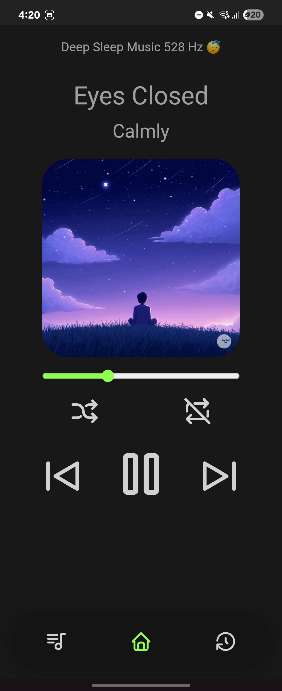
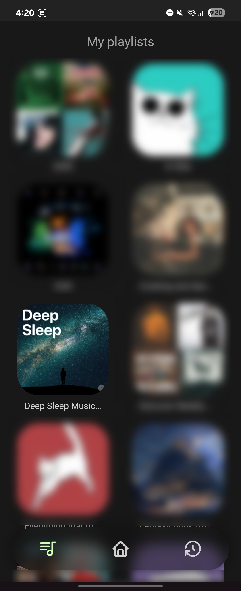
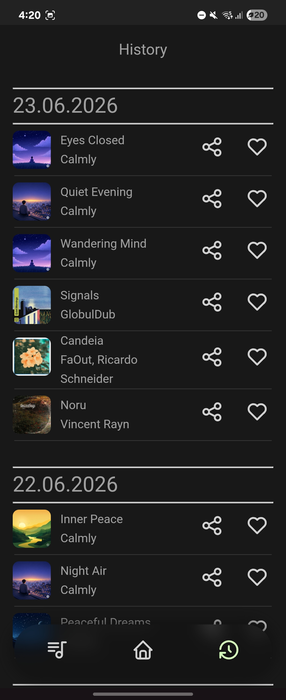
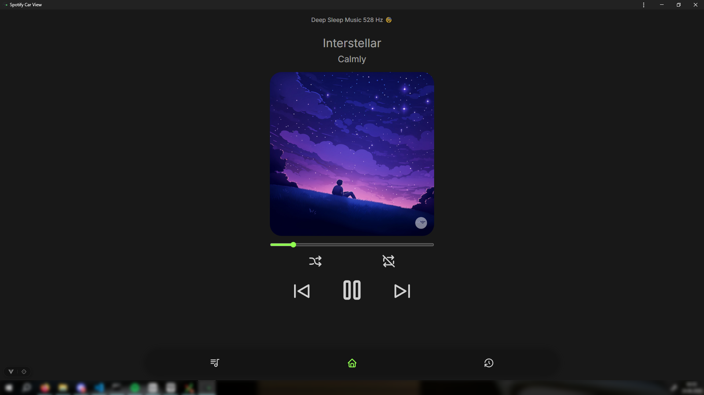
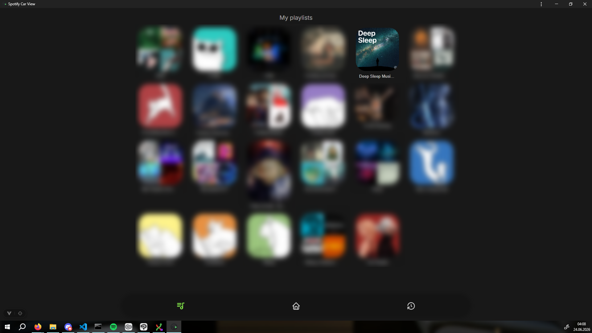
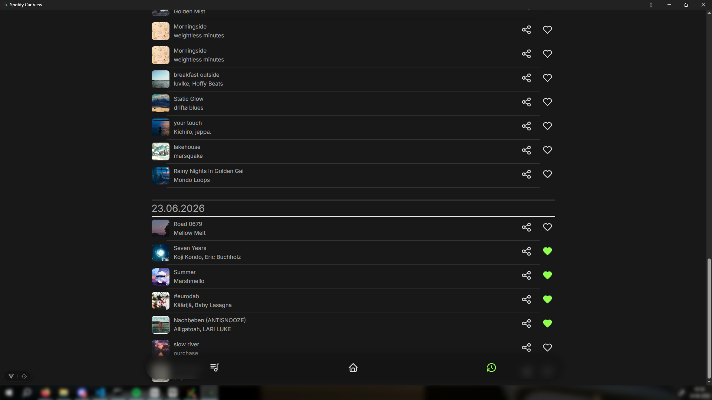

# Spotify Car View

A mobile-first Progressive Web App (PWA) for controlling Spotify while driving. Built as part of a university project focused on modern mobile web development.

---

## What it does

Spotify Car View connects to your Spotify account and gives you a clean, distraction-free interface to see what's playing, control playback, browse your playlists, and view your listening history — all optimized for use on a phone mounted in a car.

---

## Features

- **Now Playing** – shows the current track, artist, album cover, and playback progress
- **Playback Controls** – play/pause, skip, shuffle, repeat
- **Playlist Browser** – browse and start any of your Spotify playlists
- **History** – see what you've listened to, grouped by date
- **Like/Unlike tracks** – save or remove tracks from your Spotify library directly from the history view
- **Share tracks** – share a Spotify link to any song from your history via the Web Share API (falls back to clipboard copy on unsupported browsers)
- **Offline Support** – the app works offline using a service worker cache; controls are disabled and the current track is still shown
- **Offline indicator** – a visual overlay on the album cover shows when you're offline

---

## Tech Stack

**Frontend**

- [Vue 3](https://vuejs.org/) with TypeScript
- [Vite](https://vitejs.dev/) as the build tool
- [vite-plugin-pwa](https://vite-pwa-org.netlify.app/) + [Workbox](https://developer.chrome.com/docs/workbox) for service worker and caching
- [Pinia](https://pinia.vuejs.org/) for state management (auth store, Spotify API calls)
- [Vue Router](https://router.vuejs.org/) for client-side navigation

**Backend**

- [Node.js](https://nodejs.org/) with [Express](https://expressjs.com/)
- [MongoDB](https://www.mongodb.com/) + [Mongoose](https://mongoosejs.com/) for storing listening history
- Spotify OAuth 2.0 with session-based auth (HttpOnly cookies)
- Runs in Docker

**PWA**

- Web App Manifest for installability
- Service Worker with Workbox strategies:
  - `StaleWhileRevalidate` for playlist data and album art
  - `NetworkFirst` for the current player state
  - Precaching for static assets
- Offline fallback for images and navigation

---

## Screenshots

### Mobile

| Now Playing                                          | Playlists                                             | History                                           |
| ---------------------------------------------------- | ----------------------------------------------------- | ------------------------------------------------- |
|  |  |  |

### Desktop

| Now Playing                                            | Playlists                                               | History                                             |
| ------------------------------------------------------ | ------------------------------------------------------- | --------------------------------------------------- |
|  |  |  |

---

## Disclaimer

This project was built for a university course on mobile web development and as a personal tool for my own use. It's not actively maintained and there are no plans to turn it into a public product. Feel free to look around, but don't expect regular updates or support.

---

## Notes

- The app requires an active Spotify session on another device to start playback (Spotify's API doesn't allow starting playback without an active client)
- Spotify editorial playlists (e.g. Discover Weekly) can't be fetched via the API and will show without a name
- The service worker is only fully active in production builds
- Spotify Premium is required — the playback control API is not available for free accounts
